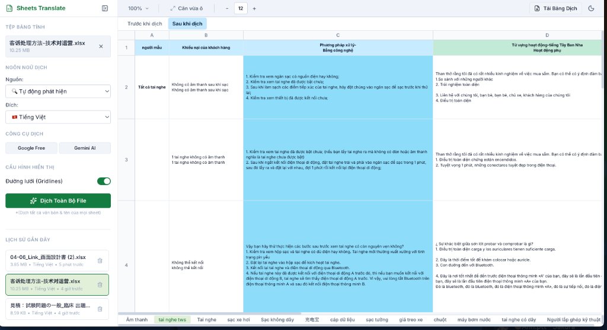
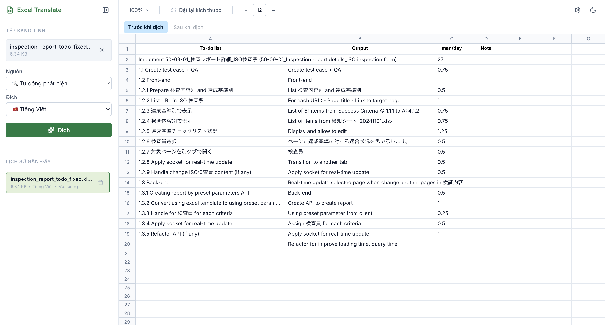

# 📊 Sheets Translate

An elegant, web-based tool for translating and reviewing spreadsheets locally. Powered by Google Translate & Gemini AI, with high-performance preview rendering, image support, and multi-language translation caching.

---

## 🚀 Demo Screenshots

### Translated Preview & Translation Interface


### High-Fidelity Cell Rendering with Embedded Images


---

## ✨ Core Features

- **Local Spreadsheet Preview**: Dense, Excel-like sheet viewer rendering text formatting, border styles, alignment, cell merges, hyperlinks, and images.
- **AI & Machine Translation**: Seamless, high-accuracy translation using Gemini 1.5 Flash or Free Google Translate.
- **Secure In-Memory API Keys**: Your Gemini API key is kept in-memory (RAM only) and never written to storage, protecting it against XSS leaks.
- **High-Performance Multi-Language Caching**: Switch between previously translated languages instantly without calling translation APIs again.
- **Google Sheets Direct Import**: Paste public Google Sheets URLs to download and load them via a secure local proxy.
- **Pure Client-Side Processing**: Files are processed in your browser using IndexedDB, maintaining absolute privacy for your data.

---

## 🛠 Tech Stack

- **Frontend Core**: React, TypeScript, Lucide Icons, Tailwind CSS (or Vanilla CSS), Vite
- **Excel Engine**: ExcelJS, custom high-performance grid renderer
- **Local Database**: IndexedDB (dexie.js)
- **Deployment**: Firebase Hosting (Static deployment)

---

## 📦 Getting Started

### Prerequisites
- Node.js (v20+ recommended)
- npm (v10+)

### Setup & Run Local
1. **Clone the repository:**
   ```bash
   git clone <your-repo-url>
   cd sheets-translate
   ```
2. **Install dependencies:**
   ```bash
   make install
   ```
3. **Start local development server:**
   ```bash
   npm run dev
   ```
   Open your browser to the URL printed in the terminal (usually `http://localhost:5173`).

### Deploy to Firebase Hosting
1. **Login to Firebase CLI (if not already logged in):**
   ```bash
   make firebase-login
   ```
2. **Build and deploy the application:**
   ```bash
   make deploy
   ```

---

## 🔒 Security & Privacy

Sheets Translate values your privacy:
- All excel files and translation caches are stored locally in your browser's IndexedDB.
- No files are ever uploaded to external servers, except for requests to translation endpoints (Google/Gemini).
- Gemini API Keys are stored strictly in-memory and will be cleared when you close the tab or refresh the page.
